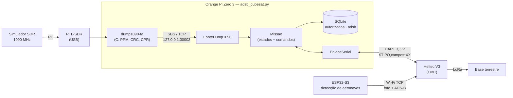
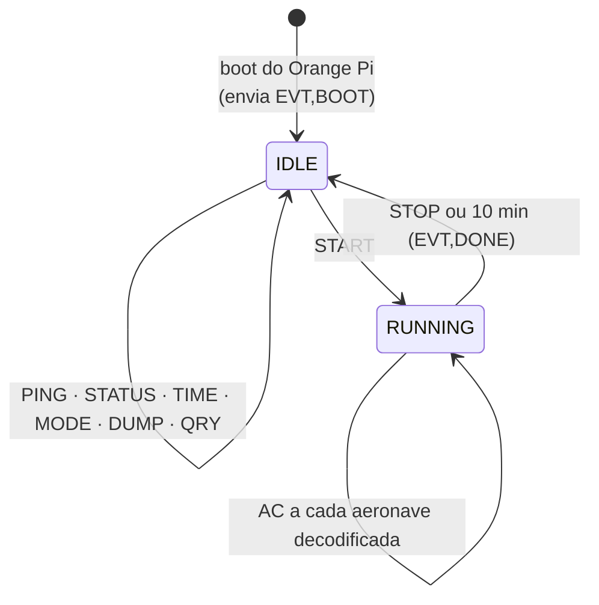
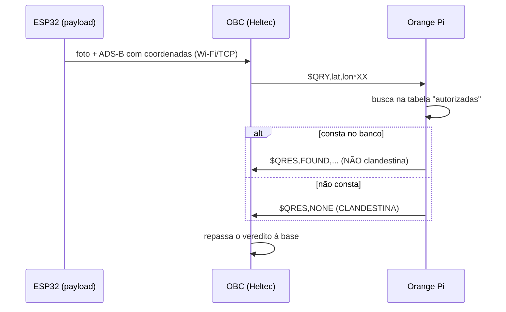

# 🛰️ CubeDesign 2026 — Módulo ADS-B (Orange Pi Zero 3)


-FF7A00)


Software de bordo do **Orange Pi Zero 3** que roda dentro do CubeSat da equipe **UERJsats**. Ele recebe sinais **ADS-B** de aeronaves com um **RTL-SDR**, decodifica tudo **a bordo** e entrega os dados ao **computador de bordo (Heltec WiFi LoRa 32 V3)** por **serial UART**. Também responde ao OBC se uma aeronave detectada pela **missão secundária** é **clandestina** ou não.

> 🤖 Vai colar isto numa IA? Use o [README_IA.md](README_IA.md) (contexto completo e regras do projeto).

---

## ✨ O que ele faz

- 📡 Capta **1090 MHz** e decodifica ICAO, latitude, longitude, altitude e velocidade (+ timestamp) de até **20 aeronaves** simultâneas, por **10 min** contínuos.
- ⚡ Usa o **dump1090-fa** (C) como decodificador: o Python só lê linhas de texto. Pouquíssima CPU/RAM no Orange Pi.
- 🔌 **Liga sozinho** quando o Orange Pi é alimentado e **espera um comando pela serial** — o rádio só liga com `START`.
- 🗄️ Guarda tudo em **SQLite** (buffer em RAM disk, cópia periódica para o SD — sobrevive a queda de energia).
- 🕵️ **Missão secundária:** o OBC manda coordenadas, o Orange diz se a aeronave está na lista de **autorizadas** (não clandestinas).
- 🧩 **Um único script** orientado a objetos: [`OrangePiZero3/adsb_cubesat.py`](OrangePiZero3/adsb_cubesat.py).

## 🏗️ Arquitetura



### Como o script funciona



**Missão secundária (clandestinas):**



---

## 📁 Estrutura

```
Missao/
├── README.md / README_IA.md
├── OrangePiZero3/
│   ├── adsb_cubesat.py          ← script de missão (roda no boot)
│   ├── testes_offline.py        ← testes sem hardware
│   └── instalacao/
│       ├── instalar_tudo.sh     ← roda os dois scripts abaixo
│       ├── instalar_ubuntu.py   ← dependências + compila o dump1090-fa
│       └── instalar_servico.py  ← sobe no boot + libera a UART de debug
├── Missao_Secundaria_V2/        ← firmware ESP32-S3 (visão computacional)
├── teste ADS-B/ · Teste de Consumo/ · OrangePiZero3/Comunicacao Serial/
```

---

## 🚀 Instalação no Orange Pi (Ubuntu 22.04)

Com o Orange Pi na internet, **como usuário normal** (não use `sudo`; os scripts pedem a senha quando precisam):

```bash
git clone <URL-DO-REPOSITORIO>
cd "<repositorio>/CubeDesign 2026/Missao/OrangePiZero3/instalacao"
./instalar_tudo.sh
sudo reboot
```

Ou em dois passos:

| # | Script | O que faz |
|---|---|---|
| 1 | `python3 instalacao/instalar_ubuntu.py` | `apt` (rtl-sdr, compilador, venv), bloqueia o driver de TV do kernel, **compila o dump1090-fa**, cria `~/venv_adsb` (pyserial + libs de reserva). instala também o **Thonny** (IDE, p/ configurar com tela). Opções: `--sem-thonny`, `--completo` |
| 2 | `python3 instalacao/instalar_servico.py` | grupos `dialout`/`plugdev`, `/var/lib/adsb`, **desativa o console da UART de debug** (`console=display`), cria e habilita o serviço `adsb-cubesat` |

Depois do `reboot`, o Orange Pi sobe sozinho em **IDLE**. Para conferir:

```bash
systemctl status adsb-cubesat
journalctl -u adsb-cubesat -f           # logs ao vivo
tail -f /var/lib/adsb/orange.log
```

Para desinstalar o serviço: `python3 instalacao/instalar_servico.py --remover`.

---

## 🔌 Ligação com o OBC

UART0 de debug do Orange Pi Zero 3 (3 pinos), **3,3 V**, 8N1, `/dev/ttyS0`:

| Orange Pi | Heltec (OBC) |
|---|---|
| TX | RX |
| RX | TX |
| GND | GND |

> ⚠️ Nunca ligue em 5 V. O baud está em **115200** (`Config.BAUD`); como o Heltec usa serial simulada por software, **valide a velocidade** no hardware real.

---

## 🧪 Como testar

### 1. Testes automáticos (sem antena, sem serial)
```bash
cd OrangePiZero3
~/venv_adsb/bin/python testes_offline.py        # ou python3 em qualquer PC
```
Cobre protocolo, banco, `QRY`, ciclo `START/STOP`, `DUMP`, flush RAM→SD e a leitura do dump1090 (usa um servidor SBS falso).

### 2. Bancada com aeronaves simuladas (sem antena)
Pare o serviço e rode à mão:
```bash
sudo systemctl stop adsb-cubesat
~/venv_adsb/bin/python adsb_cubesat.py --fonte sim --sem-checksum --pasta-sd ~/adsb_teste
```
Do outro lado da serial (um PC com adaptador USB‑serial **3,3 V** ligado nos 3 pinos, em `screen /dev/ttyUSB0 115200` ou PuTTY) digite:
```
$PING
$START,60
$QRY,-22.88,-43.30
$STATUS
$STOP
```
Sem `--sem-checksum`, gere as linhas com checksum: `python3 adsb_cubesat.py frame "START,60"`.

### 3. Com RTL-SDR e simulador SDR reais
```bash
lsusb | grep -i 0bda                  # dongle aparece?
dump1090-fa --net --quiet &           # (opcional) teste o receptor sozinho; depois: kill %1
sudo systemctl restart adsb-cubesat   # volta a IDLE; mande $START pela serial
```
Com o `START`, aparecem linhas `AC,...` na serial e o `EVT,SDR_OK`. Pare o `dump1090-fa` manual antes: só **um** processo pode usar o dongle.

### 4. Conferir os dados salvos
```bash
python3 adsb_cubesat.py banco ultimos 20
```

---

## 📨 Protocolo da serial

Texto ASCII, uma linha por mensagem: `$TIPO,campo,campo,...*XX` (`XX` = XOR hex dos caracteres entre `$` e `*`). Linhas sem checksum válido são ignoradas.

**Comandos (OBC → Orange)**

| Comando | Resposta / efeito |
|---|---|
| `PING` | `ACK,PING` |
| `START[,seg]` | inicia (padrão 600 s; `0` = sem limite) → `ACK,START,<sessão>` |
| `STOP` | encerra → `ACK,STOP` |
| `STATUS` | `STATUS,<estado>,<modo>,<uptime>,<tempCPU>,<rx>,<válidas>,<aeronaves>,<enviados>,<lat_média_ms>,<lat_máx_ms>` |
| `TIME,<epoch>` | ajusta o relógio do script → `ACK,TIME` |
| `MODE,<0\|1>` | `0` grava e transmite · `1` só grava |
| `DUMP,<n>` | reenvia os últimos *n* registros (máx. 200) |
| `QRY,<lat>,<lon>[,<icao>]` | `QRES,FOUND,...` (não clandestina) ou `QRES,NONE` (clandestina) |

**Telemetria (Orange → OBC)**

| Mensagem | Significado |
|---|---|
| `EVT,BOOT` · `EVT,SDR_OK` · `EVT,SDR_ERR,<msg>` · `EVT,DONE,<sessão>` | eventos |
| `AC,<seq>,<ts>,<icao24>,<lat>,<lon>,<alt_ft>,<gs_kt>` | uma aeronave decodificada |

---

## 🗄️ Banco de dados

`/var/lib/adsb/adsb.db` (SQLite). A tabela **`autorizadas`** é a lista de aeronaves **não clandestinas** consultada pelo `QRY`. Já vem com:

| icao24 | callsign | lat | lon | alt_ft | gs_kt | track | vrate | squawk |
|---|---|---|---|---|---|---|---|---|
| `7788FF` | TAP0803 | -22.8800 | -43.3000 | 38000 | 460 | 180 | 600 | 5511 |
| `33CC99` | UAL1890 | -23.0000 | -43.1000 | 32000 | 430 | 315 | -300 | 1200 |

Para editar (pode com o serviço rodando):
```bash
python3 adsb_cubesat.py banco listar
python3 adsb_cubesat.py banco adicionar ABC123 GOL1234 -22.90 -43.20 35000 450 90 0 2200
python3 adsb_cubesat.py banco remover ABC123
```
A tabela **`adsb`** guarda o que o receptor decodifica e **nunca** entra no `QRY`.

---

## ⚙️ Configuração

Tudo na classe `Config` (topo do [`adsb_cubesat.py`](OrangePiZero3/adsb_cubesat.py)):

| Constante | Padrão | Para quê |
|---|---|---|
| `PORTA_SERIAL` / `BAUD` | `/dev/ttyS0` / `115200` | serial com o OBC |
| `FONTE` | `auto` | `auto` (dump1090 se instalado), `dump1090`, `pymodes`, `sim` |
| `SDR_GAIN` | `49.6` | ganho do RTL-SDR |
| `MISSAO_DURACAO_S` | `600` | duração do `START` sem argumento |
| `AC_INTERVALO_MIN_S` | `2.0` | mín. entre dois `AC` da mesma aeronave |
| `TOLERANCIA_GRAUS` | `0.01` | tolerância do `QRY` (~1 km) |
| `FLUSH_INTERVALO_S` | `5.0` | cópia RAM → SD |

---

## 🛠️ Problemas comuns

| Sintoma | Causa / solução |
|---|---|
| Lixo na serial no boot | o U-Boot imprime na UART de debug; o protocolo ignora linhas sem checksum válido |
| `EVT,SDR_ERR,dump1090 saiu...` | dongle não plugado, ocupado por outro processo ou driver de TV carregado — veja `/dev/shm/adsb/dump1090.log` |
| `dump1090 não encontrado` | a compilação falhou no passo 3 do `instalar_ubuntu.py`; rode de novo e leia o erro (cai para `readsb`/pyModeS) |
| Não abre `/dev/ttyS0` | usuário fora do grupo `dialout` (refaça o `instalar_servico.py` e reinicie) ou console ainda ativo na UART |
| `QRES,NONE` para uma aeronave que devia constar | coordenadas fora da tolerância — confira `banco listar` e `TOLERANCIA_GRAUS` |

---

## 👥 Créditos

Equipe **UERJsats** · CubeDesign 2026. Firmwares ESP32 derivados do VANTsat_TX_V3 (Carlos Leal e Vitor Forny) — <https://github.com/uerjsats>.
